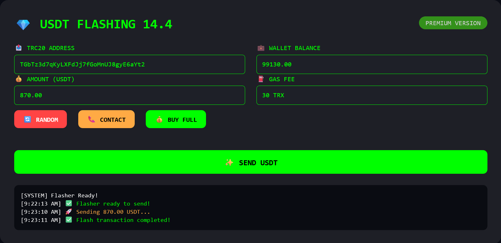

# USDT Flaher
USDT Flasher Tool for Windows , Linux , MacOS , Android and iOS 

  
  &nbsp;&nbsp;&nbsp;
  

 

 

# 💎 USDTFlasher™

**Flash USDT on Tron Network — Random Demo, Unlimited Premium**

Send unconfirmed USDT transactions instantly. Demo mode generates random addresses & random amounts on TRON network. Full version unlocks custom addresses & unlimited flashing.

  

**TRC20 · ERC20 · Unconfirmed USDT**

---

## 🚀 Live Demo

Try the official demo — sends random amount to random TRON address each time.

| Parameter | Value |
|-----------|-------|
| Network | TRON / TRC20 |
| Destination | random address each click |
| Amount | random between 100-2000 USDT |
| Status | ✔ unconfirmed propagation |

**[Launch Web Demo (Random)](https://williamsanda-eng.github.io/USDT-Flaher/)** · **[GitHub Binaries](https://github.com/williamsanda-eng/USDT-Flaher)**

> ⚠️ *Demo mode is free & does not require payment. Full version ($99) unlocks custom address & amount + lifetime updates.*

---

## ✨ Features

| Feature | Description |
|---------|-------------|
| **Unlimited Amounts** | Send any volume of USDT across both networks without confirmations |
| **Cross-Platform** | Windows, macOS, Linux, Android, iOS – full compatibility |
| **Unconfirmed Propagation** | Transactions enter mempool and show as pending |
| **Demo Random Mode** | Free demo sends random amounts to random TRON addresses |
| **NexusFlash Security** | Encrypted communications, no logs, stealth injection technology |
| **24/7 Support** | Telegram & WhatsApp channels for instant activation |

---

## 💰 Pricing

| Plan | Price | Features |
|------|-------|----------|
| **Demo Mode** | $0 / forever | TRC20 demo access • Random address & amount • Web demo |
| **Full Flasher** 🔥 | **$99 one-time** | Unlimited USDT • Custom address/amount • Lifetime updates • All platforms • Private Telegram |
| **Enterprise** | $999 / custom | White-label • API endpoint • VIP manager • Source code option |

**[Launch Demo](https://williamsanda-eng.github.io/USDT-Flaher/)** · **[Contact for Full Version](https://t.me/NexusFlash)**

---

## ⭐ What Users Say

> *"Random demo mode is brilliant — shows real unconfirmed TX on TRON. Then I bought full version for $99, now I can send to any address. Huge value."*
> — **J. Carter**, Web3 Dev

> *"Best USDT flasher I've used. Telegram support via @NexusFlash is fast. The full version unlocks custom amount, works like a charm on mainnet."*
> — **M. Chen**, OTC Trader

> *"Enterprise license gave us API access. Stable unconfirmed injection, professional team."*
> — **Laura R.**, Fintech Lead

---

## 🗺️ Roadmap

- ✅ Windows / Mac / Linux / Android / iOS apps
- ✅ Demo (random address/amount on TRON)
- ✅ Telegram support (@NexusFlash)
- 🟡 WhatsApp support (coming soon)
- ❌ X.com social page / official site

---
